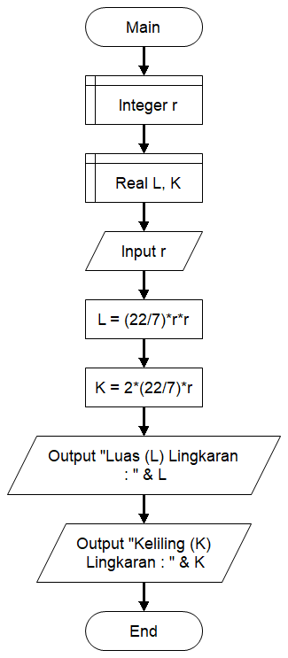
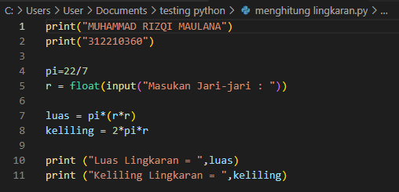
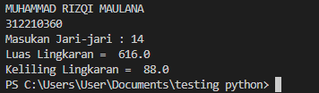

# Praktikum3
## Membuat Program Menghitung Luas dan Keliling Lingkaran
### Flowchart Luas dan Keliling  Lingkaran
  
### Buat File python
Langkah pertama buat rumus luas dan keliling lingkaran 
Luas = pi * r * r  
Keliling = 2 * pi * r 
Berikut contoh sintaks python menghitung luas dan keliling lingkaran  
 
Hasil setelah compile dan run  
 